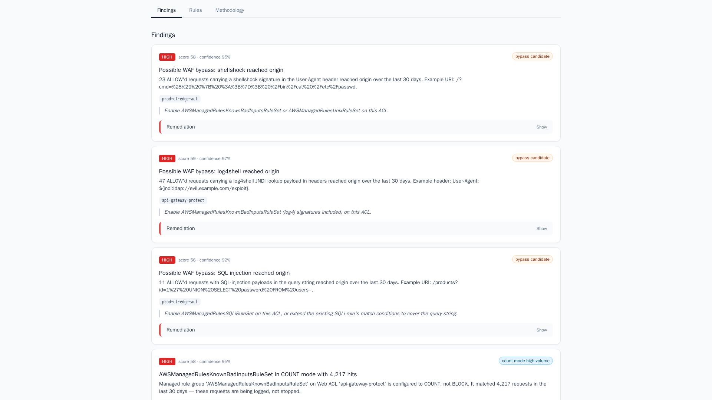
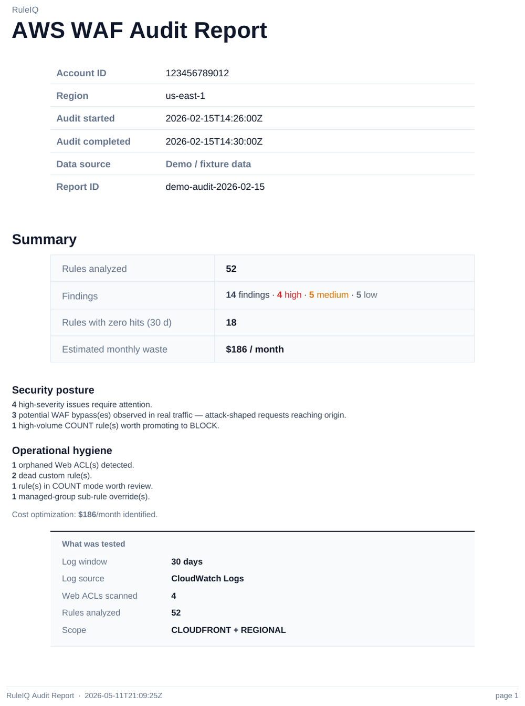
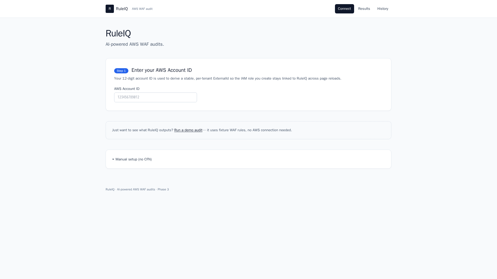

# EdgePosture — AI-powered WAF audit

> **🔗 Live demo:** https://edgeposture.io/demo — see a sample audit with no AWS setup.

> **⚠️ Status: v0.1 beta — public demo only.** EdgePosture is not yet deployable into your own AWS account. The hosted instance at the demo URL is the only running deployment; it audits the maintainer's test account. Bringing EdgePosture to other accounts (self-host, hosted SaaS, AWS Marketplace, or another model) is on the [roadmap](ROADMAP.md) — the distribution path is not yet decided.

Most AWS WAF deployments have rules that haven't fired in months, rules that should be blocking attacks but aren't, and rules nobody remembers writing. EdgePosture tells you which ones — in 2 minutes, not after a week of CloudWatch spelunking.

The headline finding: **attack-shaped traffic that reached your origin uninspected**. Shellshock, log4shell, SQL injection patterns that your WAF should have blocked but didn't. EdgePosture ships you a plain-English PDF showing exactly which signatures got through, on which Web ACL, with citations to the actual log entries — and a specific next action to close the gap.

Cleaning up dead rules and recovering the few dollars they cost is a bonus, not the point.

## Table of contents

- [What it looks like](#what-it-looks-like)
- [What it does](#what-it-does)
- [What you can do today](#what-you-can-do-today)
- [What EdgePosture asks of your AWS account](#what-edgeposture-asks-of-your-aws-account)
- [Status](#status)
- [About](#about)
- [Operating EdgePosture as a SaaS](#operating-edgeposture-as-a-saas)
- [Contributing](#contributing)

## What it looks like


*Findings dashboard — severity badges, account-specific remediation, FMS Firewall Manager indicator.*


*PDF executive summary — handed to auditors, board, customers.*


*Connect screen (future self-host) — Quick-Create CloudFormation generates the read-only IAM role in one click.*

## What it does

- Detects **attack-shaped traffic reaching your origin** despite the WAF (shellshock, log4shell, SQLi, XSS, unix CVEs) — the headline finding
- Flags rules silently sitting in **COUNT mode** when you probably think they're blocking
- Identifies which managed rule groups your Web ACL is **missing** for the attacks it's seeing
- Lists rules that **haven't fired in 30 days** — and whether they should have
- Flags **orphaned Web ACLs** (attached to nothing, still billed)
- Generates a **PDF you can hand** to auditors, board, or a customer security review
- Plain-English **remediation** per finding with the exact AWS console nav path

## What you can do today

- View the live demo at https://edgeposture.io/demo to see a sample audit — Findings, Rules, Methodology tabs, plus a downloadable sample PDF report. **No AWS setup required.**
- That is the only end-to-end flow available in v0.1. The self-serve "audit your own AWS account" flow is not yet wired in; the hosted demo only trusts the maintainer's test account.

## What EdgePosture asks of your AWS account

EdgePosture only ever reads. **Nothing in the policy below is a write, modify, or delete action.** The IAM role lives in your account; EdgePosture's App Runner service assumes it via AWS STS using a per-customer ExternalId you generate during onboarding. Credentials are ephemeral (one-hour session) and never persisted on our side.

The exact CloudFormation template is at [`cloudformation/customer-role.yaml`](cloudformation/customer-role.yaml). The complete walkthrough — Quick-Create URL, trust policy, ExternalId rotation — lives at [`docs/iam-setup.md`](docs/iam-setup.md). What follows is what each permission is for, in plain English.

### WAF inventory

These let us enumerate what firewalls exist and what's inside them.

`"wafv2:ListWebACLs"`
Lists the Web ACLs in your account so the audit knows which firewalls exist.

`"wafv2:GetWebACL"`
Reads the full rule set, default action, and visibility config of a specific Web ACL so we can analyze the rule chain.

`"wafv2:ListRuleGroups"` · `"wafv2:GetRuleGroup"`
Reads custom rule groups referenced inside your Web ACLs so the audit can inspect rules nested one level deep.

`"wafv2:GetLoggingConfiguration"`
Tells the audit where your WAF logs are going (S3 bucket or CloudWatch destination) so we can read them.

`"wafv2:ListResourcesForWebACL"`
Lists what each Web ACL is attached to (CloudFront distribution, ALB, API Gateway, AppSync, Cognito) — this is how we detect orphaned ACLs.

### Resource discovery (friendly names for what your WAF protects)

So the report can say "ALB `prod-api-lb`" instead of `arn:aws:elasticloadbalancing:...:loadbalancer/app/prod-api-lb/...`.

`"cloudfront:ListDistributions"` · `"cloudfront:GetDistribution"`
Resolves CloudFront distribution IDs to their alias names (`api.example.com`) for human-readable reporting.

`"elasticloadbalancing:DescribeLoadBalancers"`
Same idea for Application Load Balancers — names, not ARNs.

`"apigateway:GET"`
Read-only access to API Gateway metadata so we can name the REST/HTTP APIs your WAF is protecting. (`GET` is the only verb in API Gateway's permission grammar — there's no `apigateway:Get*` decomposition. This grant covers description endpoints only; no execute, create, or delete.)

`"cognito-idp:DescribeUserPool"`
Resolves Cognito User Pool IDs to user-pool names when a WAF protects a Cognito flow.

### CloudWatch Logs

If you stream WAF logs to CloudWatch Logs instead of (or in addition to) S3.

`"logs:DescribeLogGroups"`
Locates the log group your WAF is writing to.

`"logs:FilterLogEvents"`
Reads the actual WAF log events so we can compute per-rule hit counts, last-fired timestamps, count-mode samples, and bypass evidence. Filter expressions are scoped to the WAF log group only.

### S3 (WAF log archive)

If your WAF logs land in S3 (the more common path for production traffic).

`"s3:ListBucket"` · `"s3:GetObject"`
Reads WAF log objects from your WAF-logs bucket. The audit pulls the most recent 30 days' worth of logs, decompresses them in-memory on our side, and never copies them out. We rely on the trust policy's ExternalId and the role's narrow purpose to scope these reads — there is no path inside EdgePosture that reads any S3 object outside your WAF log discovery.

### Firewall Manager

For accounts where AWS Firewall Manager pushes a baseline WAF configuration from a delegated admin account.

`"fms:ListPolicies"` · `"fms:GetPolicy"`
Detects which of your Web ACL rules are FMS-managed (and therefore not freely modifiable by you). The audit flags these specially — findings on FMS-managed rules say "talk to your central security team", not "delete this rule".

---

For the full setup walkthrough — Quick-Create URL, trust policy, ExternalId provisioning — see [`docs/iam-setup.md`](docs/iam-setup.md).

## Status

Current: **v0.1 beta — public hosted demo only.** The v0.2 (SaaS MVP) milestone is in flight — Google OAuth + tenant scaffolding shipped May 12, 2026. Self-host + customer-account audit support tracked in [ROADMAP.md](ROADMAP.md).

What works today: the hosted demo at the URL above, exercising every finding type (bypass / dead-rule / count-mode / conflict / orphan / FMS), the PDF export, and account-aware "smart" remediation — all against a committed test fixture, not a live customer account.

What's next: bringing EdgePosture to other accounts (self-host, hosted SaaS, AWS Marketplace, or another model — undecided), multi-region inspection, multi-cloud (Cloudflare / Fastly / Akamai), drift-to-IaC export, scheduled audits, app-level auth.

## About

EdgePosture — AI-powered WAF audit.

Built by a former AWS edge infrastructure owner with 10+ years of WAF and CDN experience.

## Operating EdgePosture as a SaaS

EdgePosture is moving from a single-instance demo deployment toward a
multi-tenant SaaS. The first piece of that work — Google OAuth +
per-tenant rows — ships in [#45](https://github.com/pkgit215/edgeposture/issues/45).

**Closed beta.** Sign-in is gated by an explicit invite allowlist. Set
the App Runner env var `INVITE_ALLOWLIST` to a comma-separated list:

```
INVITE_ALLOWLIST=pkennedyvt@gmail.com,*@yourcompany.com
```

Exact emails and `*@domain.com` wildcards are both supported. Unset =
closed. Non-allowlisted users who sign in via Google land on a friendly
"Beta access required — email hello@edgeposture.io" page; no tenant row
is created.

**Secrets** (AWS Secrets Manager, region `us-east-1`):

| Secret | Shape | Purpose |
|---|---|---|
| `edgeposture/google-oauth` | JSON `{"client_id":"...","client_secret":"..."}` | Google Cloud OAuth 2.0 client |
| `edgeposture/session-secret` | plain text (32 bytes hex) | Signs the `edgeposture_session` cookie + OAuth `state` |

The App Runner instance role needs `secretsmanager:GetSecretValue` on
both ARNs in addition to the existing `ruleiq/openai` and
`ruleiq/mongodb` permissions.

**Public routes** (no session required):
`GET /api/health`, `GET /api/demo/*` (top-of-funnel anonymous demo),
`GET /api/openapi.json`, `GET /api/docs`, `GET /api/redoc`, and the
`/auth/*` OAuth handlers themselves. Everything else under `/api/*`
returns `401 {"error":"authentication_required"}` for anonymous
clients.

## Contributing

See [CONTRIBUTING.md](CONTRIBUTING.md) for the dev loop, test gates, and operational notes (CFN deploy, IAM policy edits, image build, App Runner config). Developer-only setup details live in [`docs/DEVELOPMENT.md`](docs/DEVELOPMENT.md).
